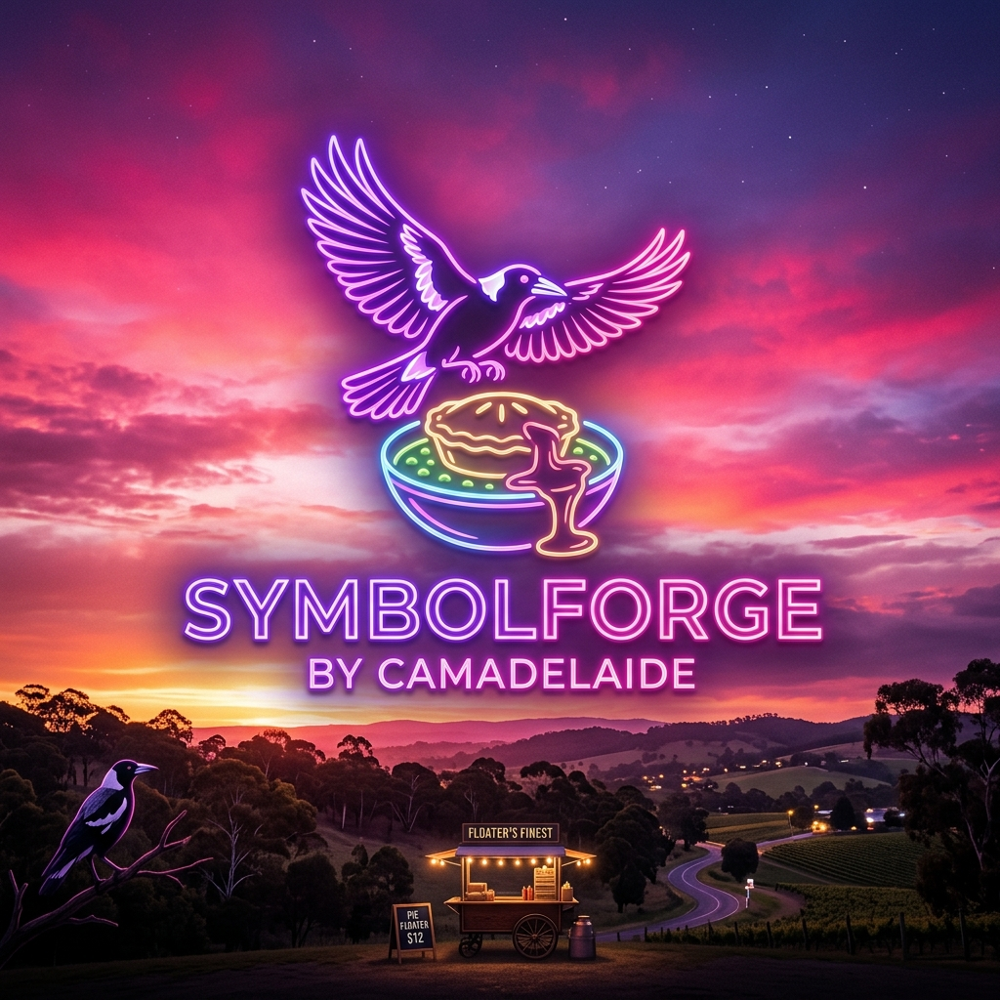

# SymbolForge™ by camadelaide

## The definitive v4.0 interpreter. OHHDAYUM.

Welcome to the future of symbolic processing, built for the Adelaide night.

### Live URL
🔥 **[https://camadelaide.github.io/symbolforge-ai](https://camadelaide.github.io/symbolforge-ai)** 🔥

---

### Why SymbolForge™?
- **Massive Token Savings:** Achieve up to 93.7% token reduction with 160+ mapped glyph sequences.
- **Deep Integration:** Built-in VaultKey (`ADELAIDE-CAM-001`) loaded with 50 shorts for immediate high-speed executions.
- **10x Verbose Expansion:** We don't just compress; we expand with a 10x factor to ensure full-spectrum operational awareness.
- **OHHDAYUM Aesthetics:** Dark neon Adelaide night theme. Purple-pink gradients. Torrens River accents. Because looking good is half the battle.

### SymbolForge Pro
Ready to go infinite? Upgrade to **SymbolForge Pro for $49/mo**, powered seamlessly by Stripe.

Enjoy the ride.

*Created by camadelaide.*
